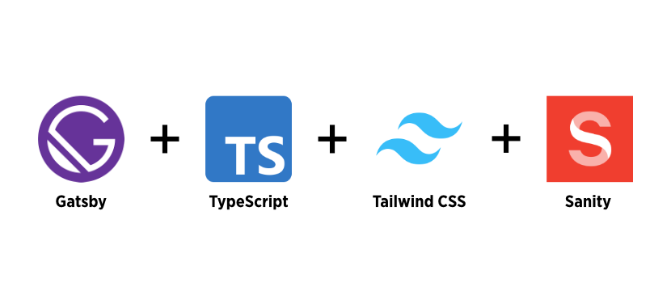

  

  </a>
  
  
  
  

 

A TypeScript starter for Gatsby. No plugins and styling. Exactly the necessary to start 🔥

No plugins installed, great for advanced users.

- 📏 **ESLint** — Pluggable JavaScript linter
- 💖 **Prettier** - Opinionated Code Formatter
- 🐶 **Husky** — Use git hooks with ease
- 📄 **Commitizen** - Conventional commit messages CLI
- 🐐 **Tests** - Jest and Testing Library
- 🚓 **Commitlint** - Lint commit messages
- 🖌 **Renovate** - Dependency update tool
- 🚫 **lint-staged** - Run linters against staged git files
- 👷 **PR Workflow** - Run Type Check & Linters on pull requests
- 🗂 **Root import** - Import folders and files using the `@` prefix.

## 🚀 Getting started

Clone this repository and run the following commands inside the project folder:

> By default, this starter uses Yarn, but this choice is yours. If you'd like to switch to npm, delete the `yarn.lock` file, install the dependencies with `npm install`, and change the CI workflows, Husky Git hooks, and lint-staged steps to use npm commands.

Website
1. `yarn`
2. `yarn start`

Sanity Studio
1. `cd ./studio`
2. `sanity start`

To view the website open `http://localhost:8000`.
To view the website graphql open `http://localhost:8000/___graphql`.
To view the sanity studio open `http://localhost:3333`

## 🤝 Contributing

1. Fork this repository;
2. Create your branch: `git checkout -b my-new-feature`;
3. Commit your changes: `git commit -m 'Add some feature'`;
4. Push to the branch: `git push origin my-new-feature`.

**After your pull request is merged**, you can safely delete your branch.

## 📝 License

This project is licensed under the MIT License - see the [LICENSE.md](LICENSE.md) file for more information.

---

Made with ♥ by Bryan James Hickey
